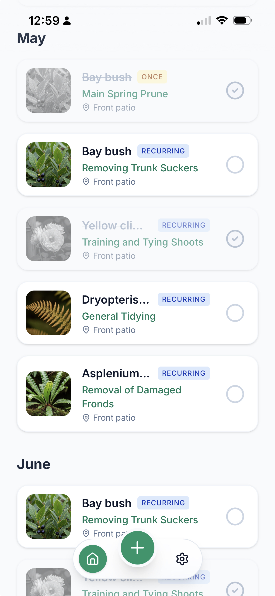
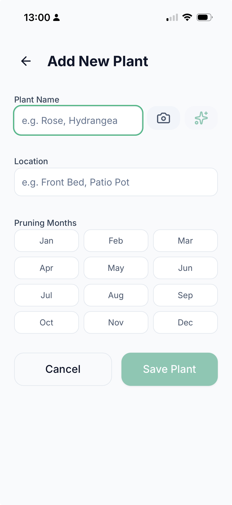
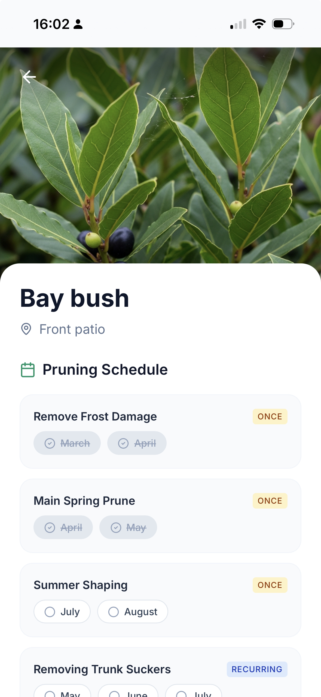

# Prune

Prune is a Progressive Web App (PWA) designed to help you care for your plants, featuring a Gemini-powered assistant. 

  ## Features
  
  -   🤖 **AI-Powered Plant Care Generation**: Simply input a plant name, and Prune uses Google's Gemini AI to automatically generate tailored care instructions and pruning schedules.
  -   🖼️ **AI Image Generation**: Automatically generates beautiful images for your plants using Imagen or Gemini fallback models.
  -   📅 **Dynamic Pruning Dashboard**: View your plants arranged by their seasonal pruning schedule. The app highlights the current month to show you what needs attention now.
  -   ✅ **Task Management**: Track your pruning tasks and mark them as completed for the current season.
  -   🔒 **Privacy-First Local Storage**: All your data (plants, tasks, and settings) is stored safely in your browser's `localStorage`. No account required!
  -   🗜️ **Smart Data Compression**: Uses `lz-string` to compress large payloads (like base64 images) so you can store a full garden without hitting browser storage limits.
  -   💾 **Import/Export**: Easily back up your garden or move it to another device by importing and exporting your data as JSON files.
    

Since this is designed to be saved to your home screen as a Progressive Web App (PWA) your data stored locally. No app store, no logins, full control over your data; just a simple secure mobile app.

[Try it out](https://everyeye.org.uk/pwa/prune/index.html#/welcome) and save to your device.

## Screenshots

| Main Screen | Add a Plant | View a Plant |
| :---: | :---: | :---: |
|  |  |  |

*Note: Please add your screenshots to the `assets/` directory and update the paths above.*

## Getting Started

### Prerequisites
- Node.js (v18+ recommended)

### Installation

1. Clone the repository (if you haven't already):
   ```bash
   git clone https://github.com/weissli/prune.git
   cd prune
   ```

2. Install dependencies:
   ```bash
   npm install
   ```

### Running Locally

1. Start the development server:
   ```bash
   npm run dev
   ```
   The app will be available at `http://localhost:3000` (or the port specified in output).

### Deployment

To deploy the application to the configured FTP server:

1. Ensure `.env.deploy` is configured with your FTP credentials.
2. Run the release script:
   ```bash
   ./release.sh <feature_update_name>
   ```
   This will create a backup of the `src` directory and deploy the built assets to the server.
